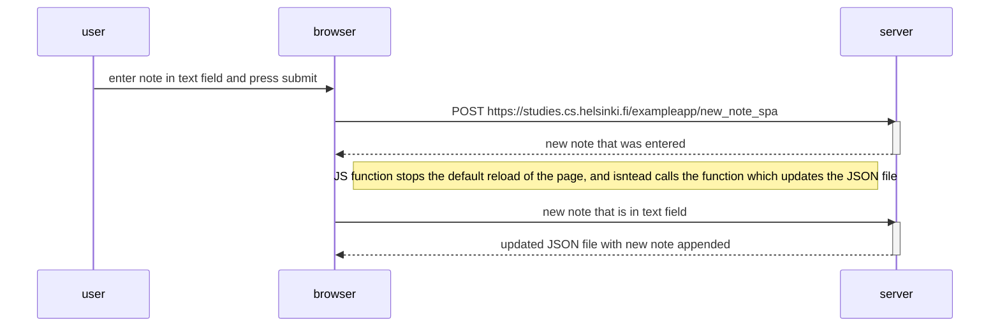

```mermaid
sequenceDiagram

participant user
participant browser
participant server

user->>browser: enter note in text field and press submit
browser->>server: POST https://studies.cs.helsinki.fi/exampleapp/new_note_spa
activate server
server-->>browser: new note that was entered
deactivate server

Note right of browser: JS function stops the default reload of the page, and isntead calls the function which updates the JSON file

browser->>server: new note that is in text field
activate server
server-->>browser: updated JSON file with new note appended
deactivate server
```
